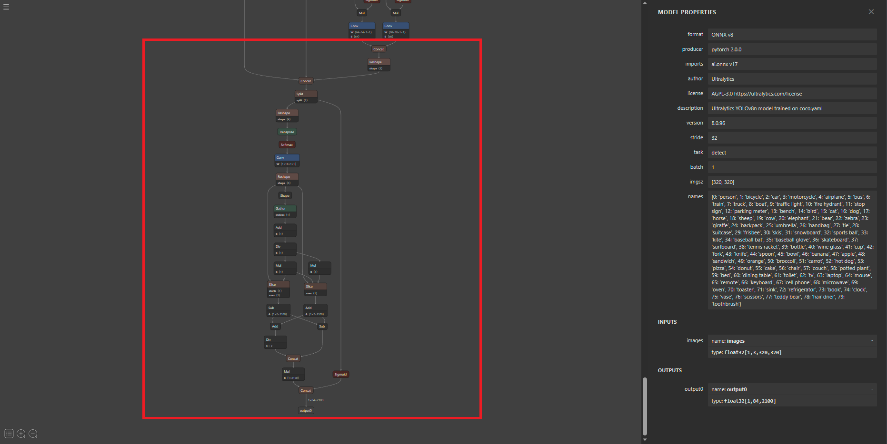
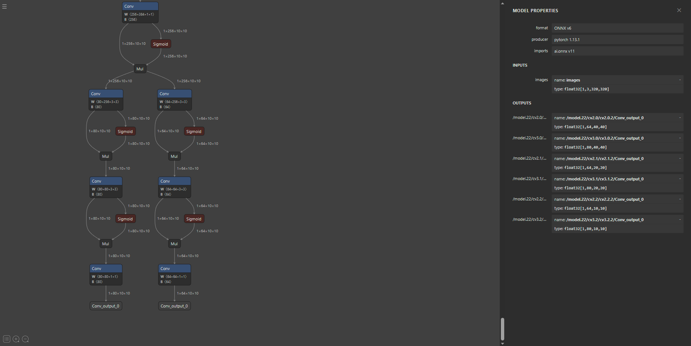
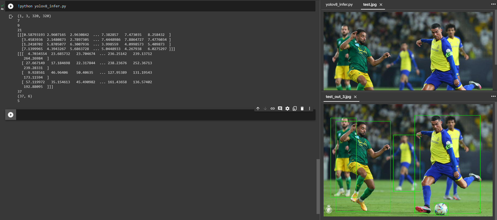
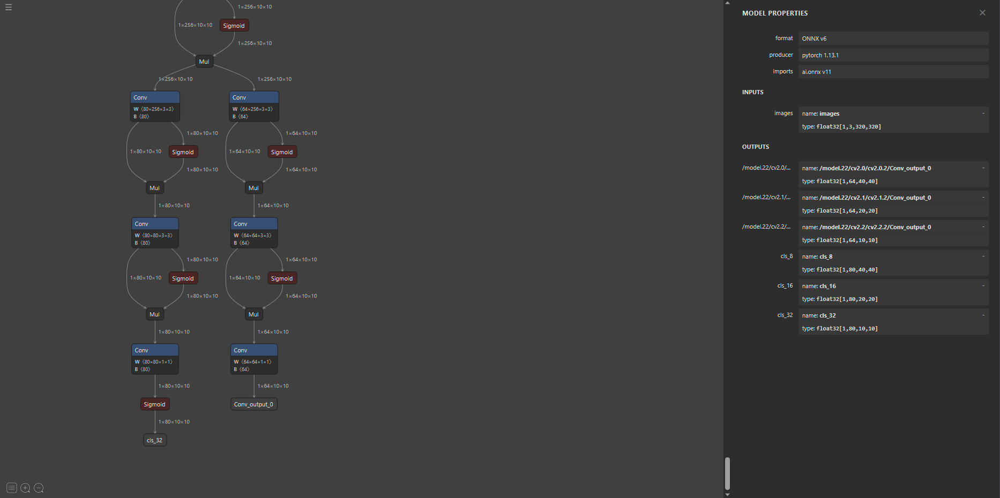
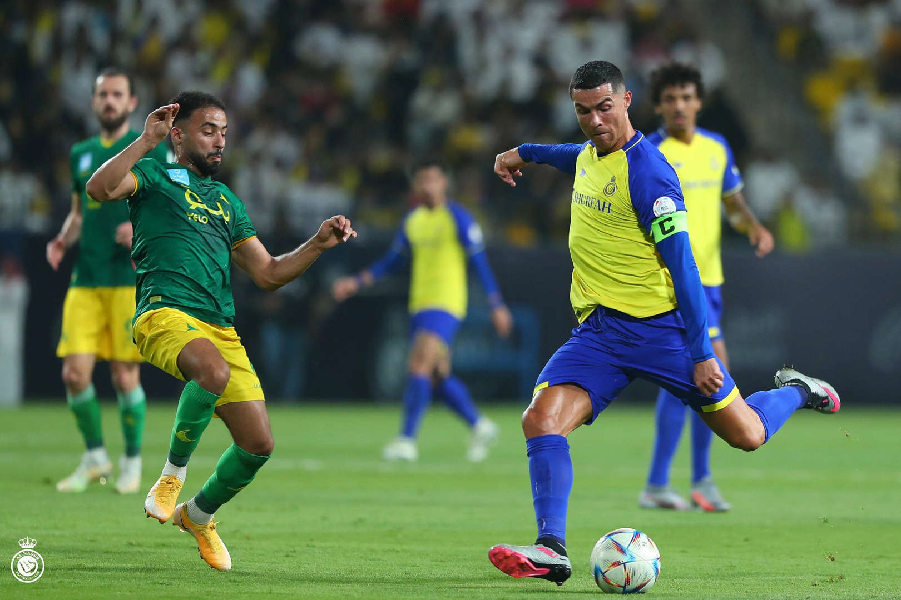
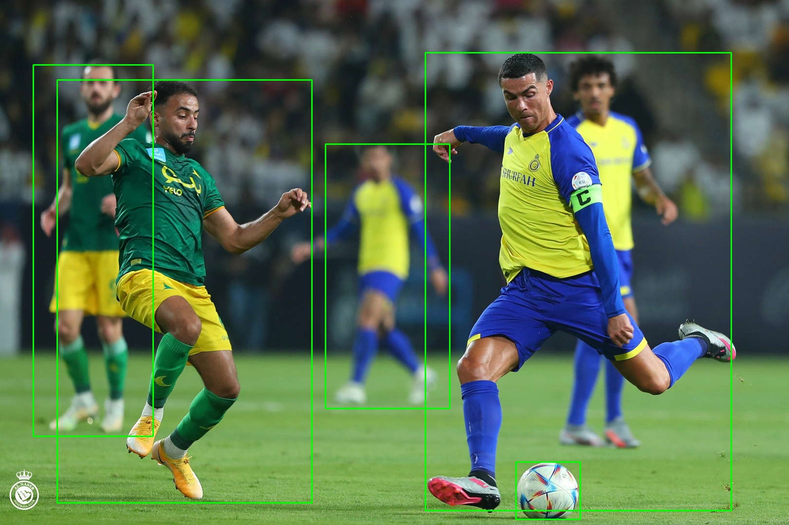

# yolov8_postprocess_for_cut_model
Postprocessing for new sota object detection model yolov8n. The models here is yolov8n cut version (cut all last postprocess layers)

When deploying yolov8 model to many AI devices like AI edge devices, SoCs,... The full version of yolov8 is not compatible because it contains some postprocess layers. When removes those layers, the postprocess published by yolov8 author is not available anymore. 

  
  <i>Input and output of yolov8n onnx model, red rectangle is part of postprocess already in the model </i>

To modify onnx model (cutting, adding layers), I used onnx-modifier tool, source: <a href="https://github.com/ZhangGe6/onnx-modifier"> onnx-modifier-tool </a>
# For python
The python code is postproces code in Python with provided model yolov8n_cut.onnx. Output of model is 6 outputs of 6 last convolution layers. (cut all layers after 6 last convolution layers)

  
  <i>Input and output of yolov8 onnx model after cutting all postprocess layers</i>

  
  <i>Running postprocess (using google colab)</i>

# For C++ in Qualcomm SoCs using SNPE sdk 1.52
The C++ code is postprocess code for SoCs device (here is Qualcomm SoCs), the provided onnx modified_yolov8n_cut.onnx will be use to convert to the compatible form with the SoCs. To optimize postprocess, I added sigmoid layers after all cls convolution layers (3 last convolution layers BCHW with C = 80), that means I do not need to do sigmoid in postprocess, the sigmoid will be handled in model running phase.

(Note: - For each SoCs, the output of model process is different based on device's architecture, that makes the postprocess different.
       - Based on my experiments, this model is very sensitive with input color space, make sure the input image is RGB before send its data to the model)

  
  <i>Input and output of yolov8 onnx model for SoCs</i>

# Demo result

  
  
   
  <i>Demo Result</i>

